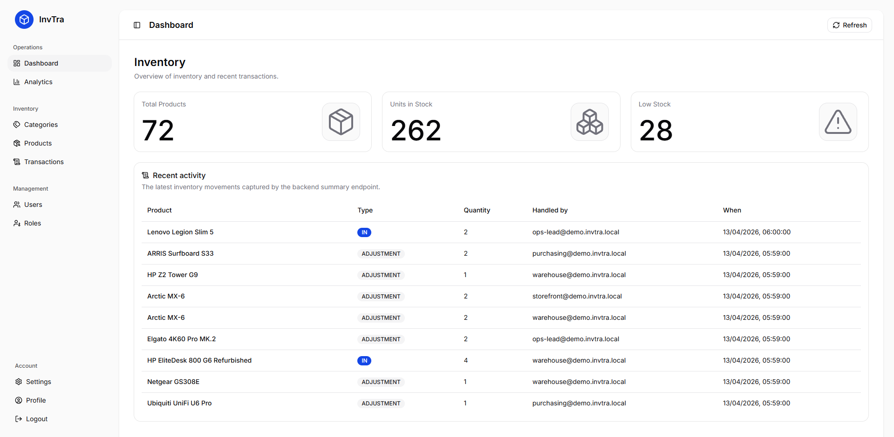
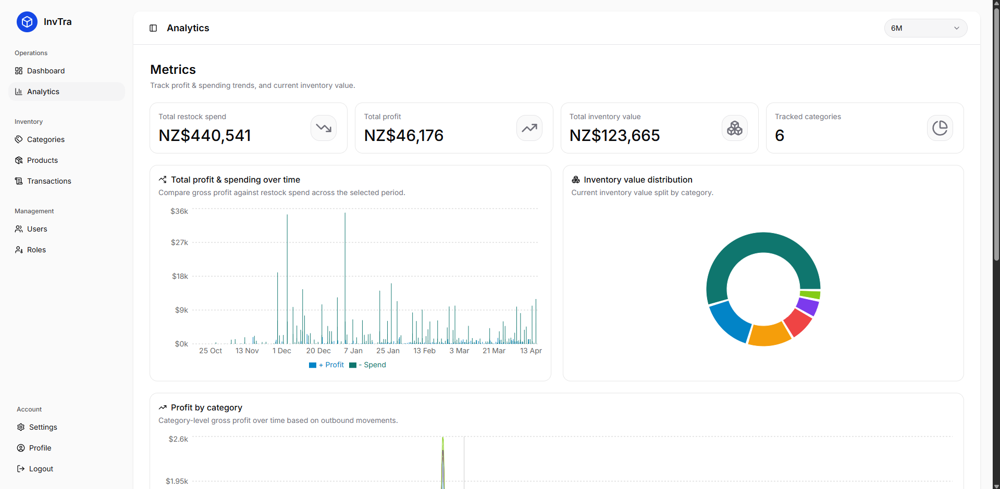
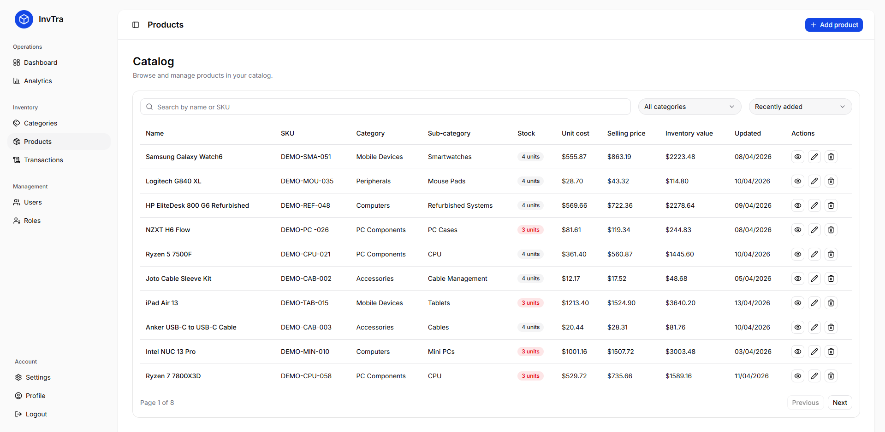
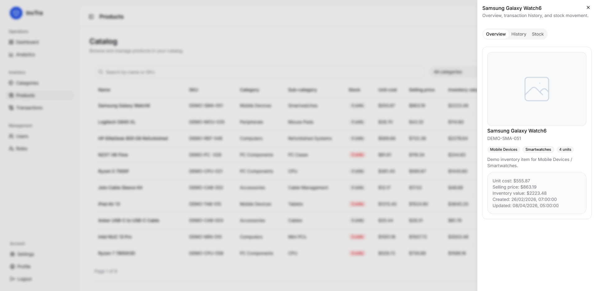
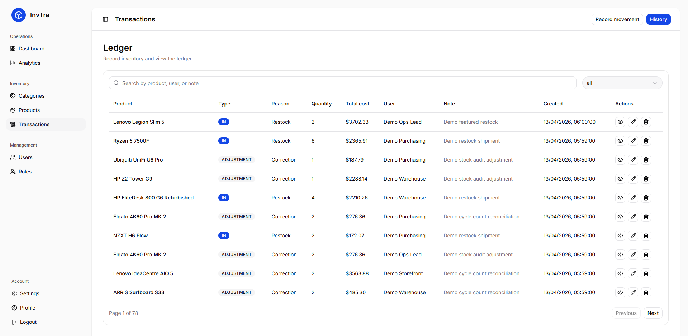
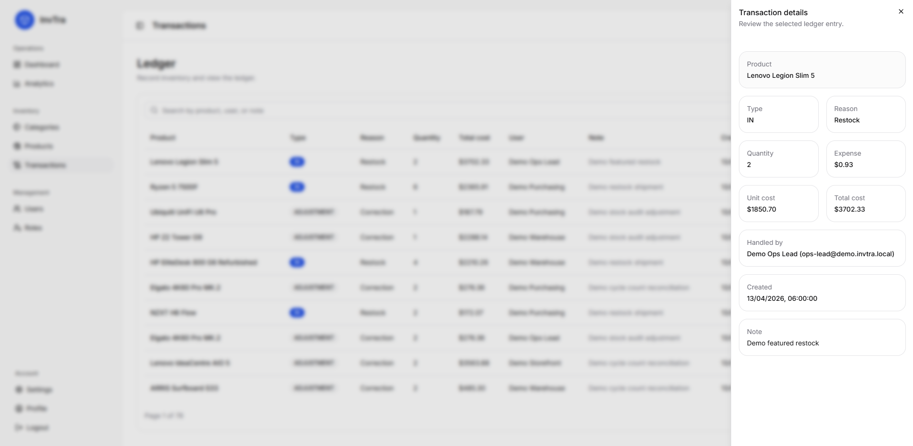
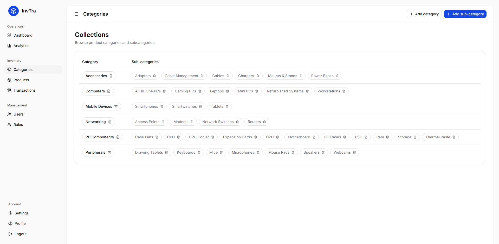
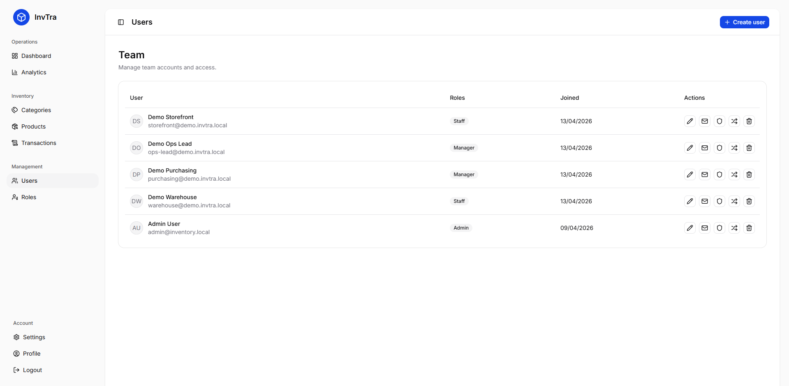
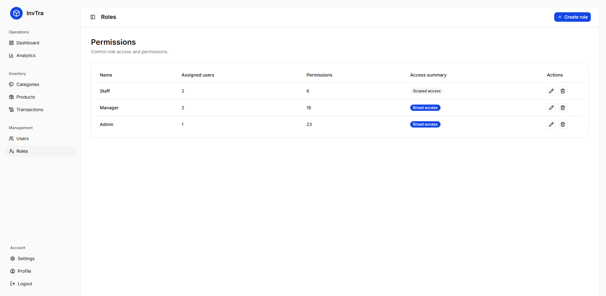
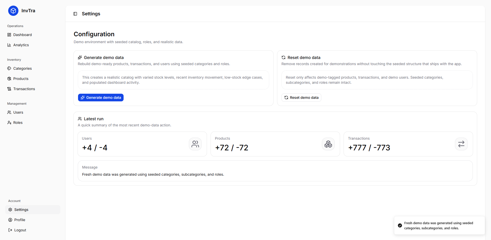

# Inventory Management App

Manage inventory operations end to end with a modern React frontend and an ASP.NET Core API for reports, categories, products, transactions, and user management. The application uses PostgreSQL for data storage and includes Terraform-based Azure infrastructure for deployment.

## Repository Structure

```text
|-- inventory-tracker.client
|-- inventory-tracker.Server
|-- inventory-tracker.Server.Tests
|-- infrastructure
|-- AZURE-DEPLOYMENT.md
|-- inventory-tracker.slnx
```

This repository contains an inventory management application with:

- Frontend React in `inventory-tracker.client`
- Backend ASP.NET Core in `inventory-tracker.Server`
- Backend test xUnit in `inventory-tracker.Server.Tests`
- Infrastructure setup Terraform & Azure in `infrastructure`, `AZURE-DEPLOYMENT.md`

## Tech Stack

Frontend:

- [TypeScript](https://www.typescriptlang.org/docs/) `~5.9.3`
- [React](https://react.dev/) `^19.2.4`
- [TanStack Query](https://tanstack.com/query/latest/docs/framework/react/overview) `^5.99.0`
- [shadcn/ui](https://ui.shadcn.com/docs) `^4.1.2`
- [Tailwind CSS](https://tailwindcss.com/docs) `^4.2.2`
- [Vite](https://vite.dev/guide/) `^8.0.5`
- [Vitest](https://vitest.dev/guide/) `^4.1.4`
- [Playwright](https://playwright.dev/docs/intro) `^1.55.0`

Backend:

- [ASP.NET Core](https://learn.microsoft.com/aspnet/core/) `.NET 10.0` with `Microsoft.AspNetCore.OpenApi` `10.0.5`
- [Entity Framework Core](https://learn.microsoft.com/ef/core/) `9.0.4`
- [PostgreSQL](https://www.postgresql.org/docs/) `16`
- [Docker](https://docs.docker.com/) `29.3.1`
- [xUnit](https://xunit.net/docs/getting-started/v2/getting-started) `2.9.3`

Infrastructure

- [Terraform](https://developer.hashicorp.com/terraform/docs) `>= 1.8.0`

Cloud:

- [Azure App Service](https://learn.microsoft.com/azure/app-service/) Linux with `.NET 10.0`
- [Azure Blob Storage](https://learn.microsoft.com/azure/storage/blobs/)
- [Azure Database for PostgreSQL Flexible Server](https://learn.microsoft.com/azure/postgresql/flexible-server/) `16`

## Getting Started

### Prerequisites

- Node.js and npm
- .NET SDK
- PostgreSQL

### Frontend

From `inventory-tracker.client`:

```powershell
npm install
npm run dev
```

### Backend

From `inventory-tracker.Server`:

```powershell
dotnet restore
dotnet run
```

The backend project is configured with SPA proxy settings, so local frontend and backend development are intended to work together.

## Documentation

- See [inventory-tracker.client/README.md](inventory-tracker.client/README.md) for frontend setup, development, and testing details.
- See [inventory-tracker.Server/README.md](inventory-tracker.Server/README.md) for backend setup, development, and testing details.
- See [infrastructure/README.md](infrastructure/README.md) for Terraform infrastructure structure and provisioning notes.

## Notes

- The frontend is a standalone Vite app under `inventory-tracker.client`.
- The backend targets `.NET 10.0` and references the frontend project for local SPA development.
- The test project references the server project with SPA project reference skipped for test execution.

## Screenshots

> A tour of the main features. Images are stored in `docs/screenshots/`.

<table>
  <tr>
    <td align="center" valign="top" width="50%">
      
      <div><sub><b>Dashboard Page</b> - Key inventory performance overview</sub></div>
    </td>
    <td align="center" valign="top" width="50%">
      
      <div><sub><b>Analytics Page</b> - Inventory metrics and trends</sub></div>
    </td>
  </tr>
  <tr>
    <td align="center" valign="top" width="50%">
      
      <div><sub><b>Products Page</b> - Browse and manage products</sub></div>
    </td>
    <td align="center" valign="top" width="50%">
      
      <div><sub><b>Product Detail</b> - Detailed product stock insights</sub></div>
    </td>
  </tr>
  <tr>
    <td align="center" valign="top" width="50%">
      
      <div><sub><b>Transactions Page</b> - Review inventory transaction history</sub></div>
    </td>
    <td align="center" valign="top" width="50%">
      
      <div><sub><b>Transaction Detail</b> - Inspect individual transaction details</sub></div>
    </td>
  </tr>
  <tr>
    <td align="center" valign="top" width="50%">
      
      <div><sub><b>Categories Page</b> - Organize products by category</sub></div>
    </td>
    <td align="center" valign="top" width="50%">
      
      <div><sub><b>Users Page</b> - Manage application users securely</sub></div>
    </td>
  </tr>
  <tr>
    <td align="center" valign="top" width="50%">
      
      <div><sub><b>Roles Page</b> - Configure roles and permissions</sub></div>
    </td>
    <td align="center" valign="top" width="50%">
      
      <div><sub><b>Settings Page</b> - Adjust application configuration settings</sub></div>
    </td>
  </tr>
</table>
