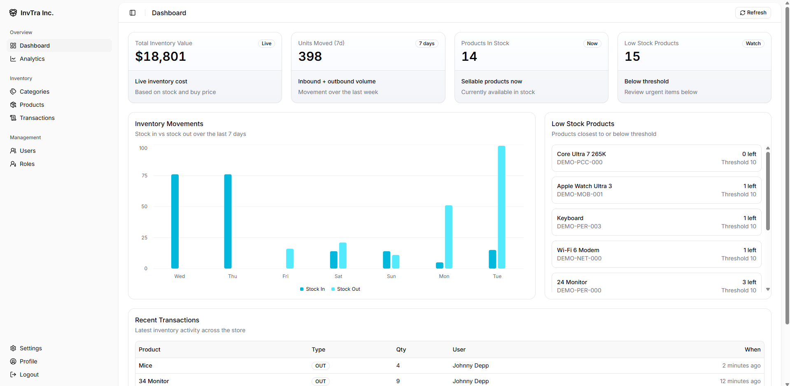
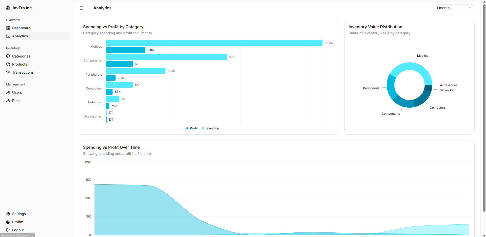
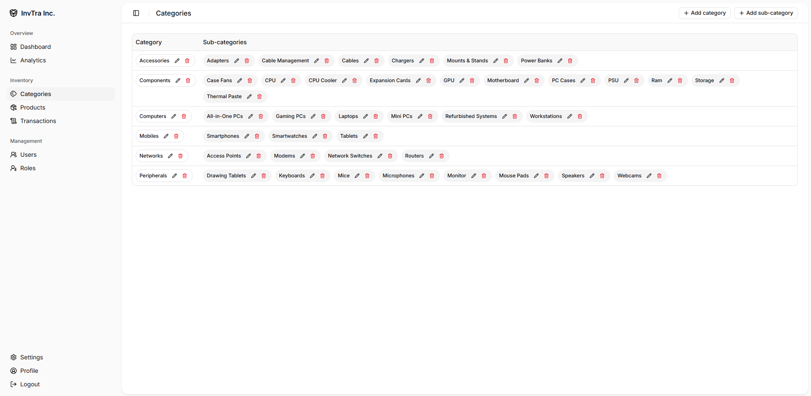
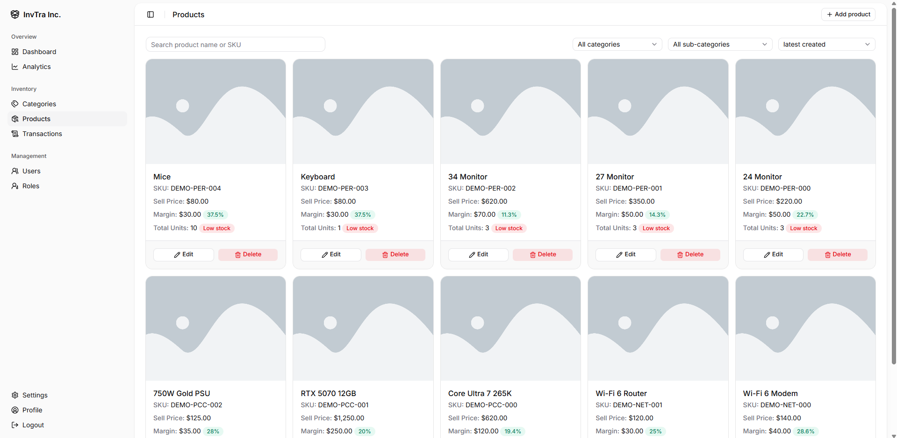
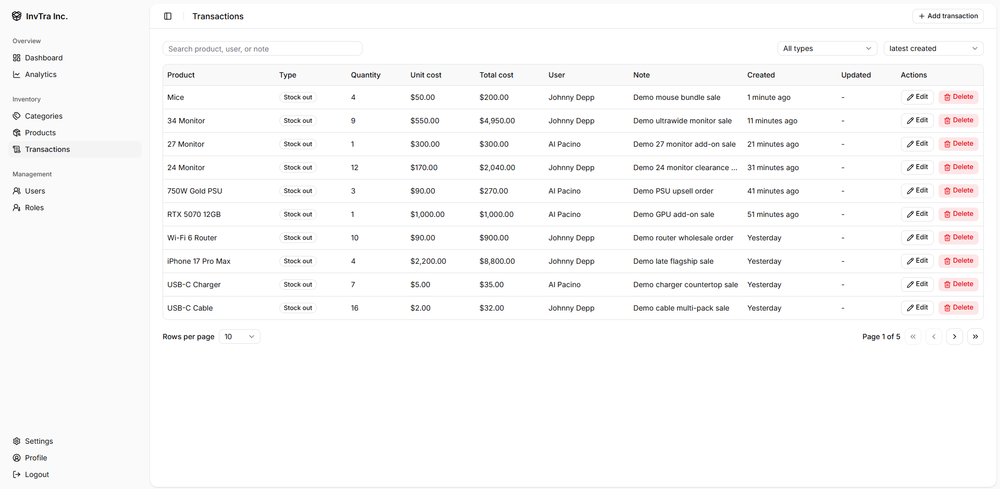
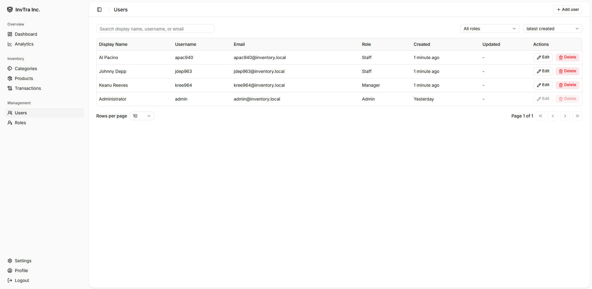
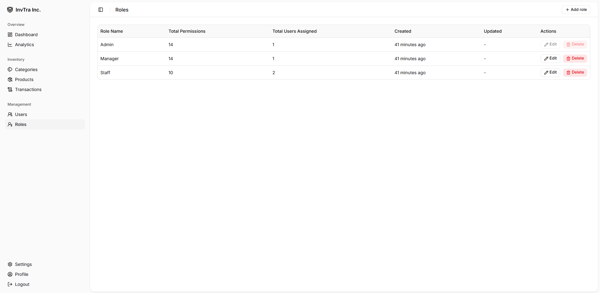
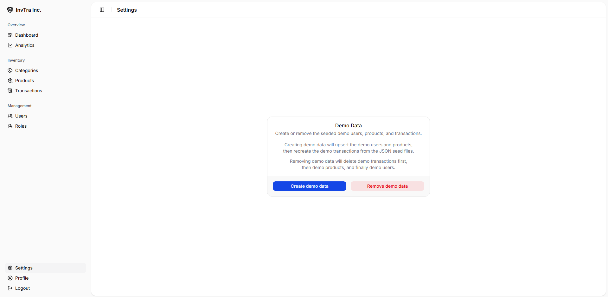

# Inventory Tracker

Inventory Tracker is a full-stack portfolio project for managing products, stock movement, users, roles, categories, and dashboard analytics. It combines a React frontend, an ASP.NET, PostgreSQL, and Terraform-based Azure infrastructure.


[See more screenshots](#screenshots)

## Features

- Dashboard and analytics views
- Category and sub-category management
- Product catalog management
- Product image storage
- Transaction stock in, stock out, and adjustment tracking
- Role-based user management

## Tech Stack

- TypeScript
- React
- ASP.NET
- PostgreSQL
- Terraform
- Azure

## Project Structure

```text
inventory-tracker-app/
├─ client/                # React frontend
├─ server/                # ASP.NET backend
├─ infra/                 # Terraform & Azure deployment setup
├─ compose.dev.yaml
├─ compose.prod.yaml
└─ README.md
```

- Frontend details: [client/README.md](client/README.md)
- Backend details: [server/README.md](server/README.md)
- Infrastructure details: [infra/README.md](infra/README.md)

## Run Locally

Start PostgreSQL and the API with Docker:

```bash
docker compose -f compose.dev.yaml up --build
```

Then start the frontend:

```bash
cd client
npm install
npm run dev
```

Local defaults:

- Client: `http://localhost:3000`
- Server & Database container in Docker: API, `http://localhost:8080`, SQL: `localhost:5432`

## Configuration

The repo includes an [`.env.example`](.env.example) for shared environment variable names.

Common local settings:

- Client: `VITE_API_BASE_URL`
- Server: database connection string, JWT key, CORS origin, and storage settings
- Infra: Azure credentials, Terraform state backend values, and production secrets

## Deployment

Production infrastructure is managed from the `infra` folder with Terraform and GitHub Actions. The current deployment target is Azure production only.

Typical deployment flow:

1. Create the Terraform state backend.
2. Configure GitHub `prod` variables and secrets.
3. Run the infrastructure workflow.
4. Deploy the API.
5. Deploy the client.

## Notes

- The client falls back to `http://localhost:4000` when `VITE_API_BASE_URL` is not set.
- The server uses PostgreSQL and applies EF Core migrations on startup.

## Screenshots

Main application views from `docs/screenshots/`.

<table>
  <tr>
    <td align="center" valign="top" width="50%">
      
      <div><sub><b>Dashboard</b> - Inventory KPIs and recent activity</sub></div>
    </td>
    <td align="center" valign="top" width="50%">
      
      <div><sub><b>Analytics</b> - Inventory value and spend trends</sub></div>
    </td>
  </tr>
  <tr>
    <td align="center" valign="top" width="50%">
      
      <div><sub><b>Categories</b> - Category and subcategory management</sub></div>
    </td>
    <td align="center" valign="top" width="50%">
      
      <div><sub><b>Products</b> - Product listing and management</sub></div>
    </td>
  </tr>
  <tr>
    <td align="center" valign="top" width="50%">
      
      <div><sub><b>Transactions</b> - Transaction movement history</sub></div>
    </td>
    <td align="center" valign="top" width="50%">
      
      <div><sub><b>Users</b> - User management and access control</sub></div>
    </td>
  </tr>
  <tr>
    <td align="center" valign="top" width="50%">
      
      <div><sub><b>Roles</b> - Role permission-oriented administration</sub></div>
    </td>
    <td align="center" valign="top" width="50%">
      
      <div><sub><b>Settings</b> - Demo-data and environment operations</sub></div>
    </td>
  </tr>
</table>
